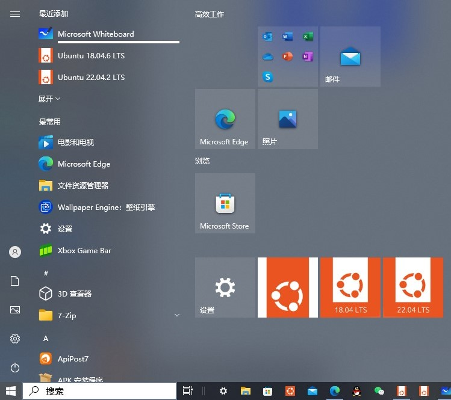
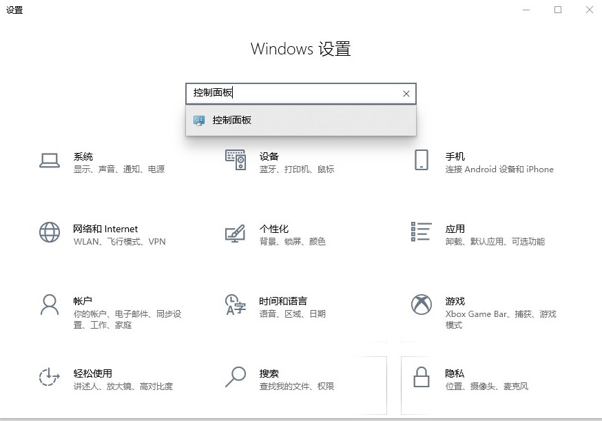
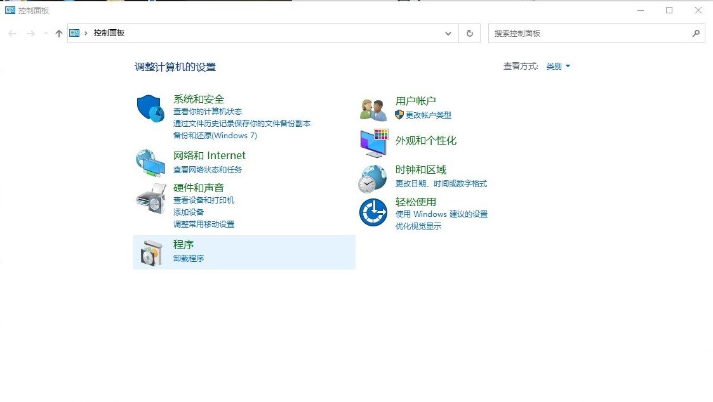
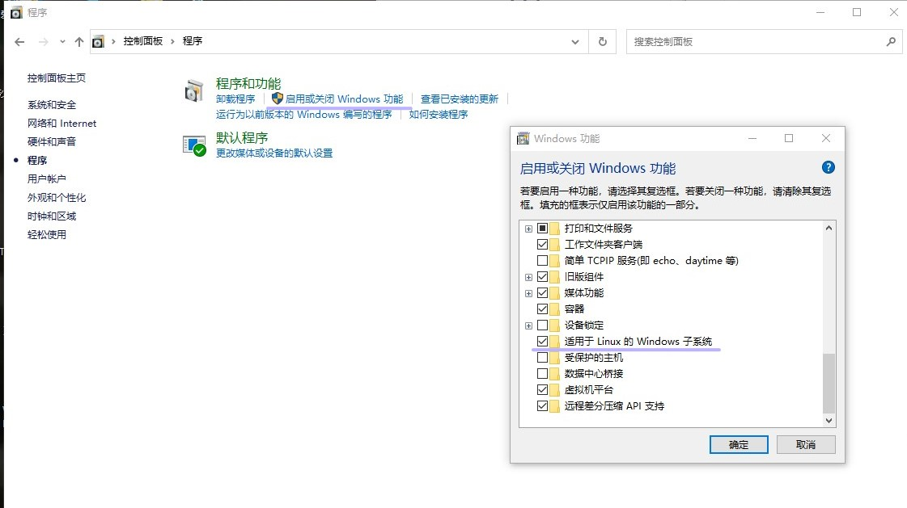
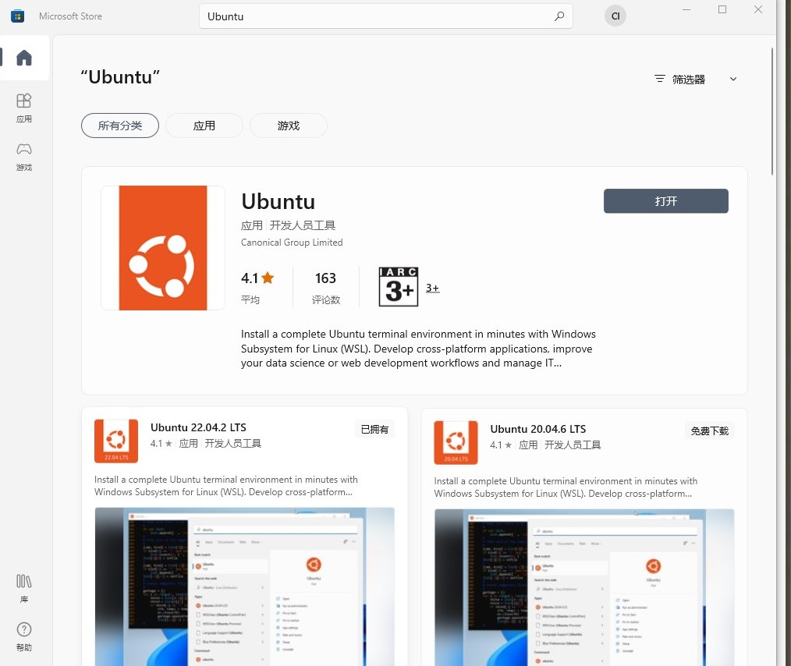

# about-bot
## 作者百草，qq1424716594，相关qq交流群117812776，有问题可以联系作者或进群交流，也可以提issues

### 介绍
简易脚本，纯命令行,面向小白，正在努力完善。。。

### 系统支持
适用于Ubuntu18.04版本以上


### 安装教程

## 手机端部署

#### 前期准备

安装下述软件，自助选择一下termux版本，建议选择0.118.0，直接点击链接可进入网址
- 若出现以下网址因为各种原因进不去的，可以进群，在群文件里找到现成安装包进行下载安装
- termux(终端)下载地址:https://f-droid.org/zh_Hans/packages/com.termux/
- 滑动验证助手下载地址：https://maupdate.rainchan.win/txcaptcha.apk
- mt管理器(后续管理及配置文件需要)下载地址:https://mt2.cn/
- 其他杂七杂八以及需要或者另外有用的app均可在qq群群文件找，没有的直接问百草要
### 开始安装
1.  打开终端输入以下代码安装Ubuntu18.04
```
 curl -sL https://gitee.com/cao100/caobot.sh/raw/master/u.sh | bash
```
装完容器后输入u进入容器，然后按顺序输入以下代码并回车（更新）

#### 先输入u进入容器

#### 不想输入u也可以选择手动进入容器
```
cd ~/Termux-Linux/Ubuntu
./start-ubuntu.sh
```

#### 务必先进入容器在执行操作!!!
```
apt update && apt install curl -y
```
#### 执行以下代码一键安装脚本（自备容器可直接复制粘贴，没有容器请先安装容器）(快捷键打不开请重新执行这条指令）
```
bash <(curl -sL https://gitee.com/cao100/caobot.sh/raw/master/caoyz.sh)
```
#### 后续打开脚本快捷键bc(别忘了打开终端后先u进入容器)

### 第一次启动bot时需要登陆qq，这里注意，不是密码输不了不让输，只是因为输密码时他是隐藏的，输了看不见很正常，建议复制粘贴以免输错

### bot想关索引详情请见如下网址(bot要用到的功能均来自插件)
- https://gitee.com/yhArcadia/Yunzai-Bot-plugins-index

## 电脑端以及服务器端部署（需要win10以上的系统）（服务器端直接看sudo -i开始的教程）

### 前期准备

打开左下角win图标



#### 打开设置，搜索控制面板



#### 打开控制面板，点击程序



#### 点击启用或关闭windows功能，找到并勾选适用于Linux的Windows子系统，如图



#### 勾选后点击确定，重启电脑

#### 重启完成后，找到Microsoft Store，也就是win自带的应用商店，搜索Ubuntu



#### 安装自己喜欢的版本，推荐稳定的18.04或者22.04，当然都是可以的

#### 安装好后，打开，第一次打开会显示installing xxxxx什么的，是在进行安装，请耐心等待，出现xxxxnewNAME什么的，就是需要你配置用户名，配置用户名之后，回车，会出现xxxxxnewPASSWORD也就是需要你配置密码

#### 注意这里密码是不显示的，不是不让输或者bug，请认真输入因为有确认密码

#### 出现xxxxx~#什么的就说明配置好了，可以开始使用，输入

```
sudo -i
```

#### 获取电脑或服务器的root权限，这里需要你输入刚刚配置的Ubuntu密码，输入正确后回车，执行以下代码更新插件包以及安装脚本（和手机安装方式一样）

```
apt update && apt install curl -y
```

```
bash <(curl -sL https://gitee.com/cao100/caobot.sh/raw/master/caoyz.sh)
```